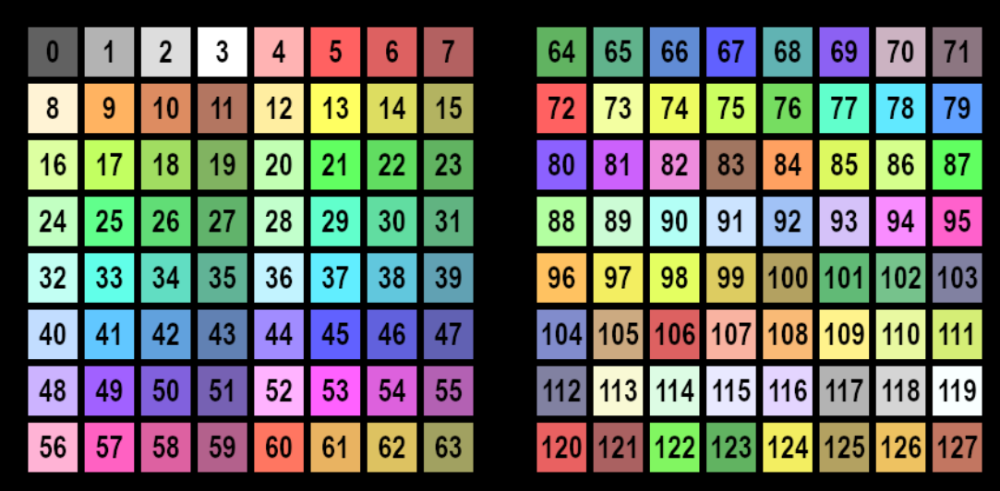

# Launchpad

Rust application to play sounds/music from a launchpad (tested with a Launchpad Mini MK3), with unlimited possibilities.

You will be able to assign each note of the grid to a sound and play it by pressing the corresponding button.
You can play multiple sounds at the same time, and also stop them directly.
You can assign up to 64 notes per page, and unlimited pages (as long as you have enough memory) with a pagination system.
To help you organize your sounds, you can also assign bookmarks to folders containing the pages.

## Getting started

The launchpad application is compiled using Rust, but you can also use the precompiled binaries.
You will need to configure a config file and also install a software to provide an output device for the application to use.

In my case, I used Virtual Audio Cable, but you can use any other software that provides an output device.

### Config file
You will need to configure the config.yaml file that is located in the same folder as the binary.

```yaml
# Path: config.yaml
midi_in_device: MIDIIN2 (LPMiniMK3 MIDI) # The input interface for the launchpad
midi_out_device: MIDIOUT2 (LPMiniMK3 MIDI) # The output interface for the launchpad
virtual_device: CABLE Input (VB-Audio Virtual Cable) # The virtual device that will be used to play sounds
bookmark_1: # The name of the bookmarks
bookmark_2: 
bookmark_3:
bookmark_4:
bookmark_5:
bookmark_6:
bookmark_7:
debug_mode: true # If true, the application will print debug messages such as the available midi devices
```

**Note:** The midi_in_device and midi_out_device are the names of the devices that are available on your system.
You can find them by running the application with the `debug_mode` set to true.

Also by default the referential will look for a folder named `pages`, as such it is recommended to create a folder named `pages` in the same folder as the binary.
The bookmarks can be used to categorize your pages.

### Pages

A page is a file containing the configuration of the notes that can be played on the sound-pad.
Below is an example on how to configure a page.

The application will list the files and create the pages based on the order of the files.

```
# Path: pages/0
11;pew.mp3;13
```

The first column is the note number, from 11 to 79, note that the numbers `19`, `29`, `39`, `49`, `59`, `69`, `79` are not available.
The second column is the path to the sound file, can be absolute or relative.
The third column is the color of the note, from 0 to 127.



## Usage
Once you've configured the page and the config file, you can launch the binary and start playing sounds.

### Playing sounds
When you press a note, the corresponding sound will be played on both the default output device and the virtual device.
We recommend not using the same device for both, as it will cause a feedback loop.

The configuration is set to use [Virtual Audio Cable](https://vb-audio.com/Cable/) as the virtual device,
sending to the Cable Input device.
On the other side (e.g. Discord) you should configure it to Cable Output.

### Merge your microphone with the virtual device (on Windows)

Select the audio properties of your mic on Windows (with the old UI) and in the "Listen"
tab, check the "Listen this device" checkbox.
Then select the virtual device as the "Listen to this device"
and you will be able to merge your microphone with the virtual device.

This process can be achieved with other software or on other OS, but this is the simplest way I've found.

### Hold to play mode

The hold_to_play mode allows you to play a sound by holding it, and stop it by releasing it.
You can still play multiple sounds at the same time.
The "blinking" status is disabled in this mode.

## Using on other midi devices

Theoretically, the application should work on any midi device not limited to the launchpad,
but some modification might be done in the code to make it compatible:
- The note constants might need to be changed, activate the debug mode will help you retrieve them.
- The colors might not be compatible, in that case you will need to change the message sent by `thread_tx_midi`.
- The `clear_grid` function might need to be changed to extend to larger grids.